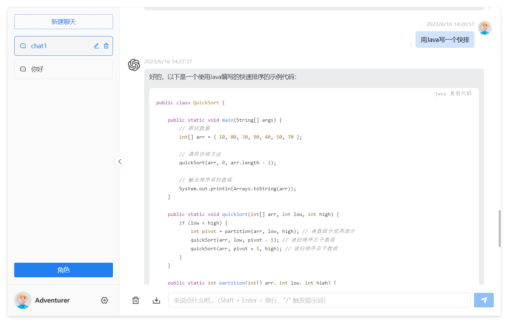
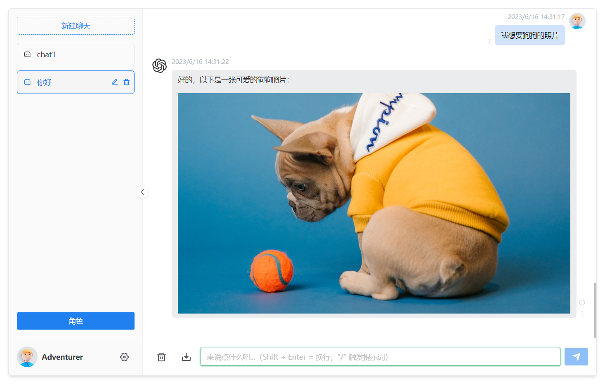

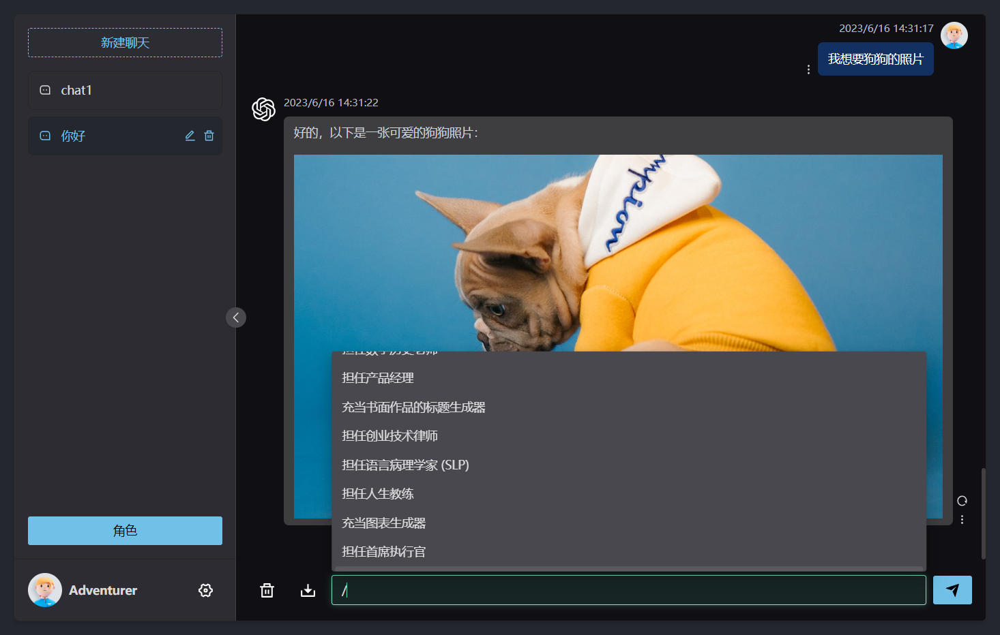

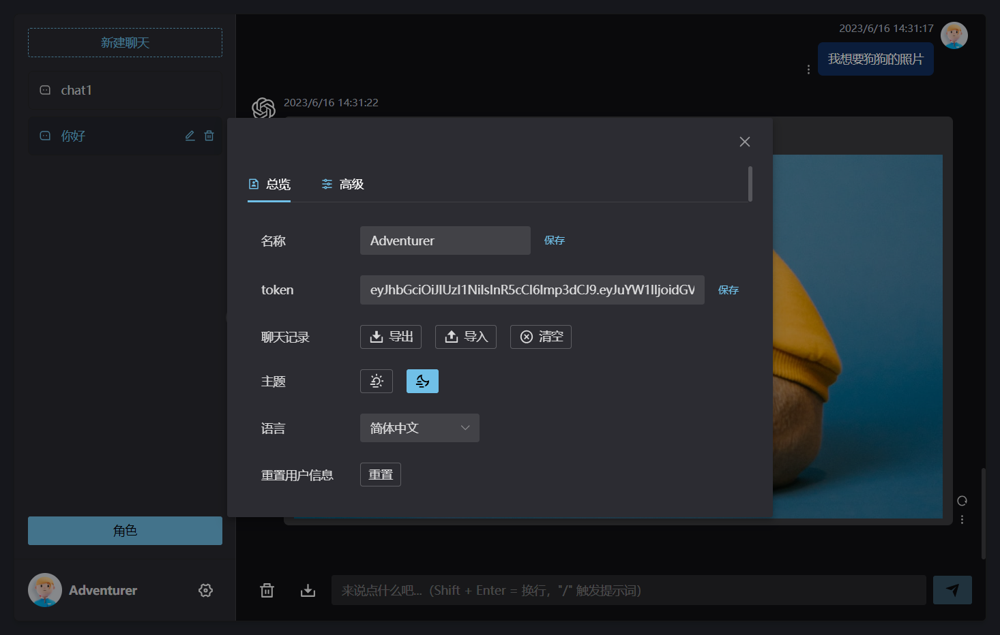

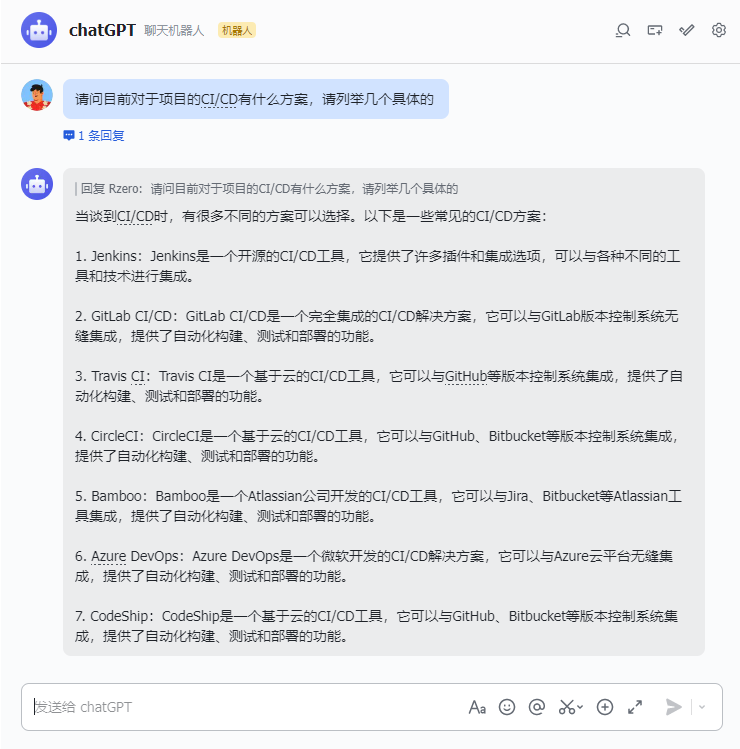

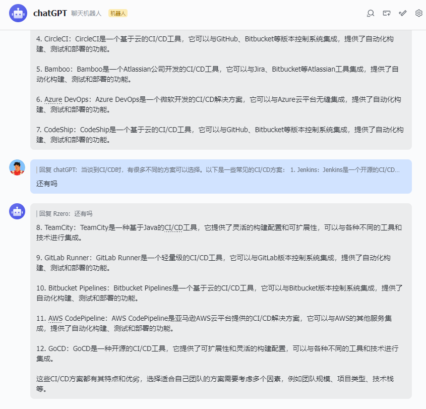

## 介绍

该项目基于Azure OpenAI 进行实现

| 功能            | 特点                                                         | 可拓展性                                       |
| --------------- | ------------------------------------------------------------ | ---------------------------------------------- |
| `Web端聊天页面` | 支持Markdown格式；响应消息呈现打字机效果；可以给模型赋予角色 | 较低                                           |
| `飞书机器人`    | 仅支持文本格式；响应消息集中返回，速度较快；                 | 较高，可以结合飞书的功能进行许多新的功能拓展。 |


#### 环境变量：

全部参数变量请查看或[这里](#环境变量)

```
后端： /service/.env.example.json
前端： /.env
```

## 待实现路线

✅web端打字机聊天效果

✅ 多会话储存和上下文逻辑

✅飞书指定消息作为上下文

✅对代码等消息类型的格式化美化处理

✅访问权限控制

✅ 数据导入、导出

✅保存消息到本地图片

✅界面多语言

✅界面主题

❎ More...


## 飞书机器人搭建

[飞书开放平台](https://open.feishu.cn/app)

- 在飞书开放平台创建应用，打开`机器人`能力

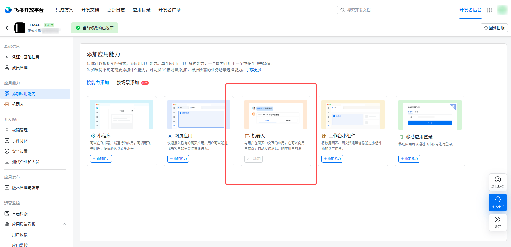

- 订阅`接收消息` 事件，并按需开通权限

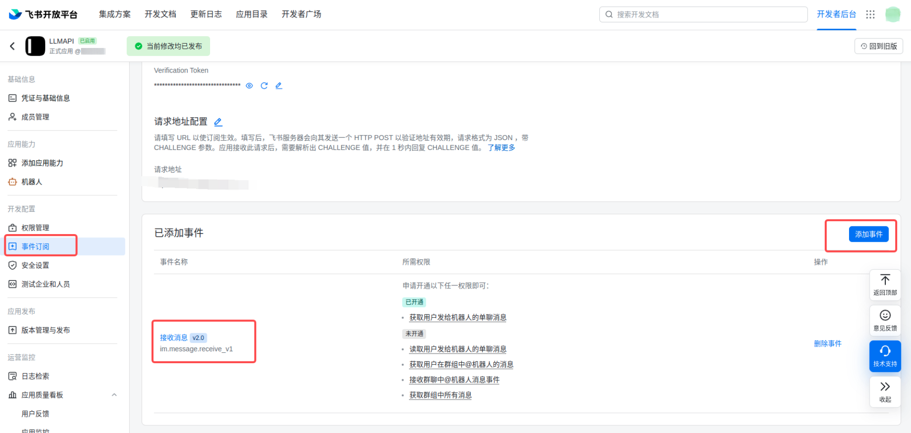

- 复制`.env.json.example`为`.env.json`，并填写`app_id` `app_secret` `encryption_key` `verification_token`，这几个字段在你的应用详情页可以找到

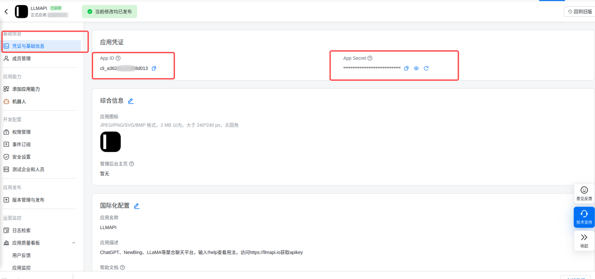

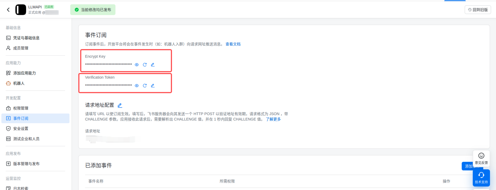


- 配置`请求地址`,格式为`http://your_domain:port/feishu`

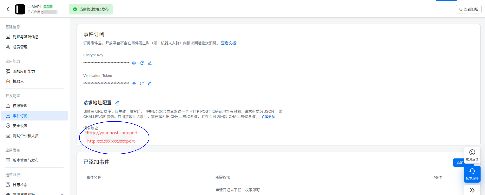


#### 机器人权限开放

应用详情 -> 开发配置 -> 权限管理

```
contact:contact:readonly_as_app

im:chat
im:chat.group_info:readonly
im:chat:readonly

im:message
im:message.group_at_msg
im:message.p2p_msg
im:message.p2p_msg:readonly
im:message:send_as_bot
```


## 前置要求

### Node

`node` 需要 `^16 || ^18 || ^19` 版本（`node >= 14` 需要安装 [fetch polyfill](https://github.com/developit/unfetch#usage-as-a-polyfill)），使用 [nvm](https://github.com/nvm-sh/nvm) 可管理本地多个 `node` 版本

```shell
node -v
```

### PNPM

如果你没有安装过 `pnpm`

```shell
npm install pnpm -g
```

### Python

Python需要3.8以上版本

```shell
python -V
```


## 安装依赖

### 后端

进入文件夹 `/service` 运行以下命令 Linux 系统用`Python3`和`pip3`

```shell
pip install -r requirements.txt
```

### 前端

根目录下运行以下命令

```shell
pnpm bootstrap
```

## 测试环境运行

### 后端服务

配置`/service/main.py`

```python
config = uvicorn.Config("main:app",host='127.0.0.1', port=3002, log_level="info")    # host：本地ip,如果是公网ip则设置为‘0.0.0.0’，port：后端服务端口号
```

进入文件夹 `/service` 运行以下命令

```shell
python main.py
```

### 前端网页

根目录下运行以下命令

配置`.env`

```
VITE_APP_API_BASE_URL= http://127.0.0.1:3002/     对应后端ip和端口
```

在根目录下

```shell
pnpm dev
```

## 环境变量

飞书相关变量：

- `feishu_app_id` 飞书机器人id
- `feishu_app_secret`  飞书机器人密钥
- `feishu_encryption_key` 飞书机器人加密key
- `feishu_verification_token` 飞书机器人身份校验码

Azure openAI相关变量：

- `gpt_app_key`  app_key
- `azure_api_base` api_base
- `azure_api_type` api_type
- `azure_api_version` api_version 

通用：

- `gpt_model` ：默认：openai-gpt，准备拓展多模型准备的变量


## 打包

#### 前端网页

1、修改根目录下 `.env` 文件中的 `VITE_GLOB_API_URL` 为你的实际后端接口地址

2、根目录下运行以下命令，然后将 `dist` 文件夹内的文件复制到你网站服务的根目录下

[参考信息](https://cn.vitejs.dev/guide/static-deploy.html#building-the-app)

```shell
pnpm build
```

##### Nginx配置

在`nginx.conf`中的**http**内加入以下配置

```
server
	{
	 	listen 8081;  # 监听8081端口
	 	server_name _; 
	 	root /home/ubuntu/ChatBot/dist/;       #打包的dist路径 
	 	# 防止爬虫抓取
		if ($http_user_agent ~* "360Spider|JikeSpider|Spider|spider|bot|Bot|2345Explorer|curl|wget|webZIP|qihoobot|Baiduspider|Googlebot|Googlebot-Mobile|Googlebot-Image|Mediapartners-Google|Adsbot-Google|Feedfetcher-Google|Yahoo! Slurp|Yahoo! Slurp China|YoudaoBot|Sosospider|Sogou spider|Sogou web spider|MSNBot|ia_archiver|Tomato Bot|NSPlayer|bingbot")
		{
			return 403;
		}
	       	#禁止访问的文件或目录
		 location ~ ^/(\.user.ini|\.htaccess|\.git|\.svn|\.project|LICENSE|README.md)				     
		 {
       			 return 404;
	       	}
   		location / {
	        #解决（直接通过ip+路径访问出错，只能在网页内跳转）问题
	        try_files $uri $uri/ /index.html;
	       	}
    	location /api/ {
	        proxy_pass http://0.0.0.0:3002/;              #后端服务，如果和后端在同个服务器则不用修改，如果不同服务器，则修改为实际ip+端口
			proxy_set_header X-Forwarded-For $proxy_add_x_forwarded_for;
	       	}
	}
```

#### 后端服务

1、配置`/service/main.py`

```
config = uvicorn.Config("main:app",host='0.0.0.0', port=3002, log_level="info")    # ‘0.0.0.0’运行后，为 服务器公网ip+3002
```

后端服务对外暴露目的是为了让飞书接入，可以通过白名单添加飞书的请求ip  [参考文档](https://www.feishu.cn/hc/zh-CN/articles/237645168094-%E9%9B%86%E6%88%90%E5%B9%B3%E5%8F%B0-ip-%E7%99%BD%E5%90%8D%E5%8D%95)

2、后端目前无需打包，在系统中挂起运行即可，进入`/service`，其中log.log为运行日志文件

```shell
 nohup python3 main.py >> log.log 2>&1 &
```

